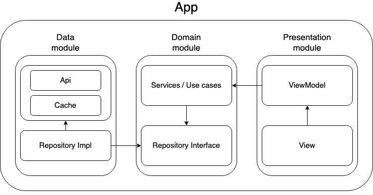

# Flutter template

Template Flutter project using provider with single state, events and actions, following the architecture shown below:

<br/>

<br/>

## Initial Setup

Before running the project you have to fetch the dependencies and generate the missing file by executing:

```
./run_build_runner_packages
./run_flutter_gen_l10n
```

The project is configured to support two environments: 'dev' and 'prod'. To run the project with a specific flavor, use the command:

```
flutter run --flavor dev/prod
```

## Firebase Setup

To integrate Firebase into the template project, use the Firebase CLI for Flutter. Note: Firebase files are git-ignored, so avoid including them; the pipeline handles Firebase initialization during app builds.

If adding Firebase, include the FIREBASE_PROJECT property in the pipeline secrets. For iOS, additional properties may be necessary. Refer to the pipeline documentation for more details.

### For local Firebase setup:

Use the flutterfire_configure_manual script in the project directory or perform manual setup by executing the following commands:

```
curl -sL https://firebase.tools | bash
dart pub global activate flutterfire_cli
firebase login
flutterfire configure
```

Ensure you have the required tools installed and follow the authentication steps for Firebase.
The template project utilises most of the firebase packages, so remove those that are not needed.

## Package Identifiers

To modify the package identifier:

### Android

Navigate to android/app/build.gradle. Locate the productFlavors section and specify the dev and prod package identifiers as required.

### iOS

Open the project in Xcode and within the Runner/Flutter folder, find configuration files named 'dev' and 'prod'. Update the PRODUCT_BUNDLE_IDENTIFIER with the desired identifier. Adjust the app display name if needed.

Feel free to include additional properties as necessary.

### Branding

## App Icons

Android -> Open the android project and click on generate image asset -> then select the flavor you want to generate the logos for.
IOS -> Open the ios project in xcode, in Runner/Assets update the icon assets (1024x1024 size)

## Splash screen

In the flutter app folder update the flutter_native_splash yaml files. Then generate for the flavors

```
dart run flutter_native_splash:create --path=flutter_native_splash-web.yaml (For web)
dart run flutter_native_splash:create --flavors dev,prod
```

### Mason usage

First activate it globally:

```
dart pub global activate mason
dart pub global activate mason_cli
```

If you want to add new bricks, use:

```
mason new brickname
mason add brickname --path /path/to/the/brick
```

To use the brick:
```
mason make brickname
```